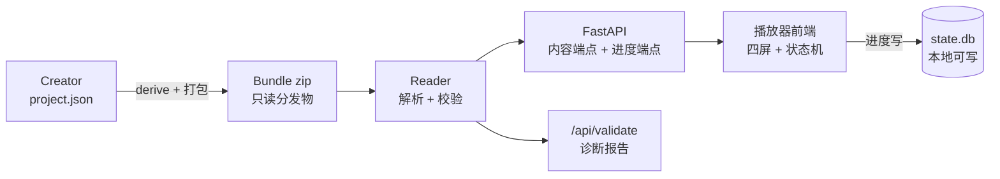
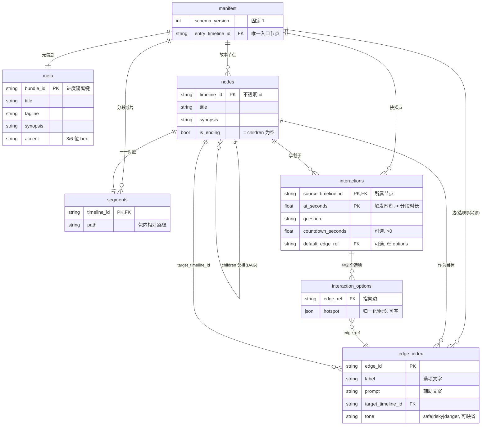
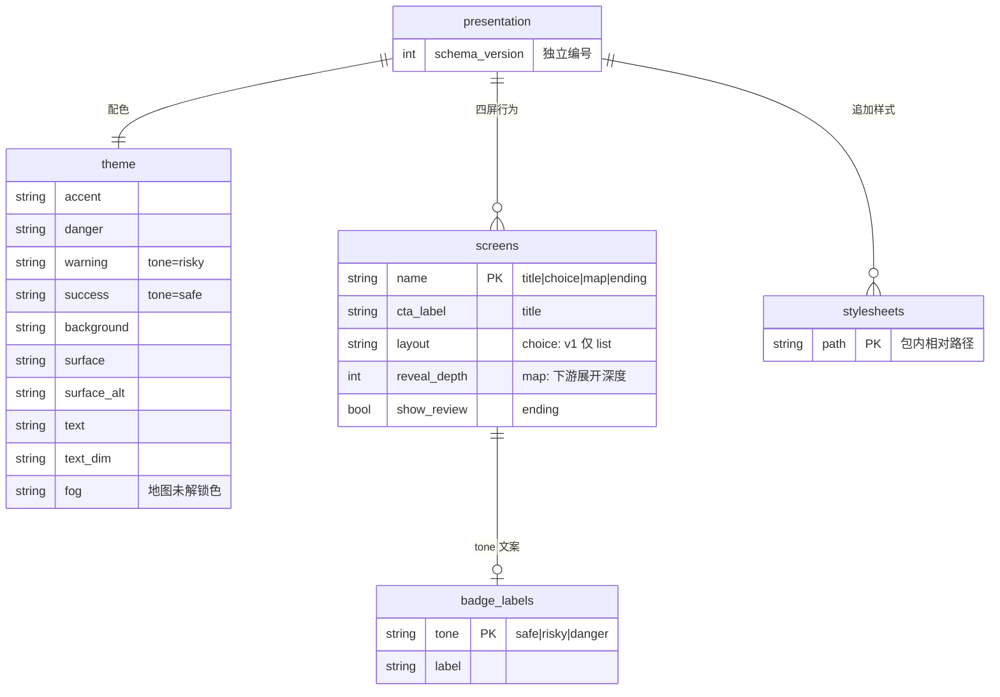
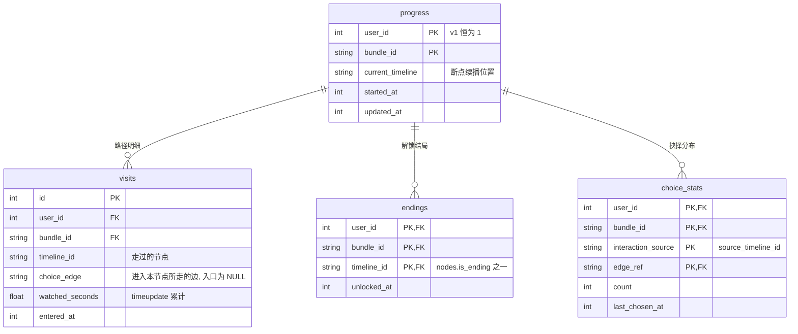

# IVB Schema ER 图

字段命名**严格对齐 `docs/bundle-format.md`**,即 Creator 真实产出的形状
(`nodes` / `edge_index` / `*_timeline_id`,不是早期 `schema.json` 的
`edges` / `source_node_id`)。

参考了 `sandbox/互动视频/er-diagram.md`,并按 v1 定稿做了三处删减:
去掉 `users` / `tokens`(不做鉴权)、去掉 `variables`(无 Condition 实现)、
去掉 `cover` / `thumbnail`(包内无图片资产)。

## 0. 全景

三层通过 `bundle_id` 关联。**包只读、库可写**,两者物理分离。

---

## 1. 内容层 — manifest.json

`titles` 表未画出:它是 `nodes[*].title` 的扁平副本,仅为旧播放器兼容保留,
新代码不得依赖。

---

## 2. 表现层 — presentation.json(可选)

**全部字段可选**;缺任一项 → 放映端内置默认回填,只出 `warning`。
`stylesheets` 的 CSS 内容不进 JSON,按路径从包里读文本后注入 `<style>`。

---

## 3. 状态层 — state.db(SQLite)

### 3.1 为什么保留 `user_id`

列在、值恒 `1`、**不建 `users` / `tokens` 表**。将来加回多用户只需补鉴权与
外键,不需要迁移既有 `state.db`。

### 3.2 派生指标(不建表,查询即得)

| 指标 | 计算 |
|---|---|
| 覆盖率 | `COUNT(DISTINCT visits.timeline_id) / COUNT(nodes)` |
| 结局进度 | `COUNT(endings) / COUNT(nodes WHERE is_ending)` |
| 当前路径 | `visits` 按 `entered_at` 排序的 `timeline_id` 序列 |
| 抉择偏好 | `choice_stats` 按 `interaction_source` 分组的 `count` 占比 |

`variables` / `Condition` 不设计:内容层没有任何字段消费它,建表即死表。
