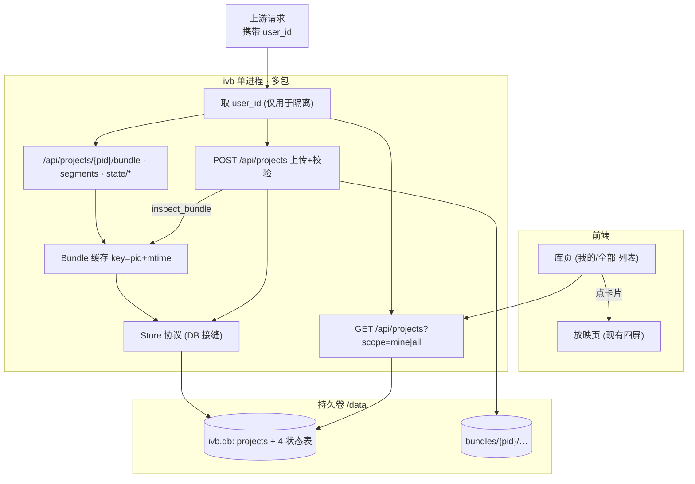

# IVB Player 服务设计 — 多用户互动视频展示

> 状态：已实现（§9 七步全部落地）。本文是 ivb 从"单包放映器"升级为"多用户互动视频展示服务"的落地依据。
> 相关规范：包格式见 `bundle-format.md`，状态层 ER 见 `er-diagram.md`。

## 0. 定位

ivb 是**互动视频的展示微服务**：接收 Creator 导出的互动视频包，向多个用户放映，并按
`(用户, 项目)` 记录各自进度。它不生产内容、不导出包——包是 Creator 的产物，ivb 只读。

与现状（单包放映器）的差距：

| 能力 | 现状 | 目标 |
|---|---|---|
| 用户 | `user_id` 恒为 1 | 多用户隔离：按上游传入的 `user_id` 分用户存进度 |
| 包 | 一进程启动时绑死一个包 | 一个进程运行时按 `project_id` 服务任意多包 |
| 目录 | 无 | 上传过的项目登记成目录，可列表浏览 |
| 入口 | 无列表页 | 前端有"我的 / 全部"库页，点卡片进放映 |
| 上传 | 靠 `serve <path>` 指定 | HTTP 上传接口，接收 Creator 导出的 zip |

## 1. 已锁定决策

| # | 决策 | 内容 |
|---|---|---|
| 1 | user_id 来源 | 身份的产生与校验由**其它团队（上游/网关）**负责，不在 ivb 范围。ivb 只**接收请求里带来的 `user_id`**，纯粹当数据隔离键用——不签发、不认证、不管登录。 |
| 2 | 标识类型 | `user_id`、`project_id` 一律 **TEXT**。（`user_id` 现为 INTEGER，一并转 TEXT；开发期数据可弃，直接重建库，无迁移成本。） |
| 3 | 列表视图 | 两档：**我的**（`WHERE owner_user_id = 当前用户`）/ **全部**（不过滤）。**不建 visibility 列**——"我的/全部"是查询过滤，不是逐包权限。将来若要 private，再加一列 `visibility`。 |
| 4 | 存储选型 | **SQLite 起步**，保持 `ProgressStore` 为唯一 DB 接缝；扩 PostgreSQL 时只换接缝实现（见 §8）。 |
| 5 | 重复上传 | 暂不处理。同 `project_id` 再上传：覆盖 `bundles/{pid}/` 文件 + 更新目录行（owner 保持首次上传者），进度不动。 |

## 2. 关键概念：`bundle_id` vs `project_id`（分层，勿混）

- **包格式层**：manifest 的 `meta.bundle_id` 是 IVB v1 规范字段，Creator 产出，**跨端契约，名字不动**。
- **状态存储层**：SQLite 里的隔离键叫 **`project_id`**（原 `bundle_id` 列改名），语义更准——它的值等于 Creator 的 `project_id`。
- 二者**取值相同**（Creator 侧 `bundle_id = project.project_id`），但分属两层，命名各自独立。
- **唯一性由 Creator 保证**：`project_id` 全局唯一、不复用。故单库多包按 `project_id` 隔离是安全的。
- **进度只活在 ivb 的 `state.db`**，与包/导出完全解耦；导出物里没有进度，ivb 也不导出。

## 3. 架构



要点：
- **一个进程服务所有包**：`project_id` 从 URL 路径进来，按目录表解析到磁盘上的包，`inspect_bundle` 结果按 `(pid, mtime)` 缓存。取代现状 `create_app(bundle_path)` 的启动期单绑。
- **读包入口不变**：仍走 `inspect_bundle`，复用"bundle 非空 ⟺ 无致命诊断"这条不变式——上传校验与放映共用同一个裁判。
- **ivb 不拥有身份**：`user_id` 由上游随请求传入，ivb 只在数据层用它做 `(user_id, project_id)` 隔离，不参与认证/授权判断。

## 4. 数据模型

单文件 `data/ivb.db`（WAL 边车 `ivb.db-wal`/`-shm` 须与主库同卷）。

### 4.1 新增目录表

```
projects(
  project_id       TEXT PRIMARY KEY,   -- = Creator meta.bundle_id，全局唯一
  owner_user_id    TEXT NOT NULL,      -- 上传者
  title            TEXT,
  synopsis         TEXT,
  node_count       INTEGER,
  ending_count     INTEGER,
  interaction_count INTEGER,
  storage_path     TEXT,               -- bundles/{project_id}
  created_at       BIGINT,
  updated_at       BIGINT
)
```

### 4.2 状态四表（改动点）

`progress / visits / endings / choice_stats`：
- 列 `bundle_id` → **`project_id`**
- 列 `user_id`：INTEGER → **TEXT**
- 复合主键 `(user_id, project_id, …)` 维持；`idx_visits_lookup` 同步改名。

（`schema.sql` 是纯状态层，改名可整片替换；`store.py` 亦然。）

## 5. 端点

每个请求携带 `user_id`（由上游/网关传入，ivb 不校验其真伪），仅用于进度与"我的"列表的隔离。

| 方法 | 路径 | 用户输入 | 作用 |
|---|---|---|---|
| POST | `/api/projects` | user_id + multipart zip（可选 title） | `inspect_bundle` 校验：致命 → 422 回显诊断并丢弃；合法 → 落盘 `bundles/{pid}/` + upsert `projects`（owner=当前用户） |
| GET | `/api/projects?scope=mine\|all` | user_id | 库列表；`mine` 过滤 owner，`all` 不过滤 |
| GET | `/api/projects/{pid}` | user_id | 单项目详情 |
| GET | `/api/projects/{pid}/bundle` | user_id | `project_for_player` 内容+表现 join（缓存命中不重复读包） |
| GET | `/api/projects/{pid}/segments/{name}` | — | HTTP Range 流（不要求 user_id） |
| GET | `/api/projects/{pid}/styles/{name}` | — | 包内样式 |
| GET/POST | `/api/projects/{pid}/state/{progress,visit,watch,choice,ending,reset,stats}` | user_id + pid | 进度读写，key = `(current_user, pid)` |
| GET | `/api/health` | — | 保留 |

## 6. 结构性改动（实现要点）

1. **`create_app` 从单包改多包**：签名 `create_app(data_dir, db_path)`；新增按 `pid` 解析包的中间步骤（查目录 → 取 `storage_path` → `inspect_bundle` → 缓存）。
2. **Bundle 缓存**：`dict[pid] -> (mtime, Inspection/Bundle)` + 锁；mtime 变化或重新上传时失效。
3. **端点前缀迁移**：现有 `/api/bundle`、`/api/state/*` 全部收到 `/api/projects/{pid}/…` 之下。
4. **前端 `BASE` 动态化**（前提）：现 `state.js` 写死 `BASE = ""`，挂子路径会全 404。改法：`create_app` 支持 `root_path`，`index()` 注入 `<base href>`，`state.js` 从 `document.baseURI` 反推 `BASE`，`app.js` 的 `segmentUrl` 走 `BASE`。
5. **库列表页**：新增前端屏（卡片：标题/上传者/节点·结局·抉择点数/更新时间 + "我的/全部"切换），点卡片路由到该项目放映页。
6. **Store 接缝**：把 `ProgressStore` 方法集抽成 `Protocol`，`projects` 目录读写并入；SQL 只活在 SQLite 实现内部，`server/app.py` 不出现 SQL（现状已如此）。

## 7. 部署与持久化

### 7.1 当前阶段（本地持久卷）

- **单实例**：`--data /data`，持久卷上放 `ivb.db(+WAL)` 与 `bundles/` → 容器重建/滚动发布不丢。
- **约束（写死）**：SQLite = 单写者，**只能一个副本**。横向扩容前必须先迁 PG（§8），否则并发写会锁库/损坏。
- **不要把 SQLite 放网络文件系统**（NFS/EFS/云盘多挂载）：WAL 依赖本机文件锁，跨主机共享会损坏。
- **包体存储**：`bundles/{project_id}/` 目录与 DB 同卷，容器外持久化。

### 7.2 未来演进（OSS + PG）

当需要多副本/高可用时：

| 组件 | 当前 | 未来 |
|---|---|---|
| 进度/目录（行数据） | SQLite 单文件 | PostgreSQL（多副本并发） |
| 包体（mp4 大文件） | 本地 `bundles/` 目录 | 对象存储（OSS/S3） |

**存储后端抽象**：为平滑迁移，`bundles/` 的读写应封装成 `BundleStorage` 协议（类似 `ProgressStore` 接缝）：
- 当前实现：`LocalBundleStorage(data_dir)` —— 读写本地目录
- 未来实现：`OSSBundleStorage(endpoint, bucket)` —— 上传/下载/流式读取 OSS

上层（上传端点、放映端流媒体）只调协议方法，不碰具体存储。切换时只换实现类，端点/前端不动。

**迁移触发条件**：
- 需要 >1 个放映服务副本 → 先迁 PG（DB）+ OSS（包体）
- 单实例但包体总量大（>100GB）或要 CDN 加速 → 可只迁 OSS，DB 保持 SQLite

## 8. 未来切 PostgreSQL 的路径（接缝预留）

换 PG 的收益只有一个：**多副本并发 + 容器重建天然不丢 DB**。为将来无痛切换，现在起遵守：

- 所有 SQL 关在 `ProgressStore`（SQLite 实现）内部；上层只调方法。切 PG = 新增一个实现同一 `Protocol` 的类。
- 少用 SQLite 专有语法外溢到接缝之上。
- 届时主要改动集中在：驱动 `sqlite3`→`psycopg`、连接由"一次一连接"改**连接池**（FastAPI lifespan 建/销）、占位符 `?`→`%s`、`PRAGMA`/`AUTOINCREMENT`/`user_version` 换 PG 等价物、迁移器（Alembic）、测试需活库（testcontainers）。
- **PG 只解决行数据（进度/目录）**；`bundles/` 里的 mp4 仍是大文件，多副本时要换**对象存储**，与 DB 选型是两件事。

## 9. 实现顺序（每步带测试，独立可交）

1. **改名打底**：状态层 `bundle_id → project_id` + `user_id → TEXT`。
2. **Store 接缝 + `projects` 目录表**：抽 `Protocol`，加目录读写。
3. **多包路由**：`create_app(data_dir)` + 按 pid 解析 + 缓存；端点迁到 `/api/projects/{pid}/…`。
4. **user_id 接入**：从请求读取上游传入的 `user_id`，接进状态读写与"我的"列表过滤（ivb 不做认证）。
5. **上传**：zip → 校验 → 落盘 → 目录。
6. **前端**：`BASE` 动态 + `<base href>`；库列表页 + 路由进放映。
7. **部署**：`--data` + 持久卷 + 文档补全。

## 10. 非目标（本期不做）

- 身份的产生、认证、授权、登录、凭据签发——由上游/其它团队负责，ivb 只消费传入的 `user_id`。
- 逐包可见性（private/public）——只有"我的/全部"查询视图。
- 重复上传的版本/冲突处理。
- 多副本高可用（先单实例 + 持久卷）。
- 包体对象存储 OSS（本期本地 `bundles/`，未来按 §7.2 迁移）。
